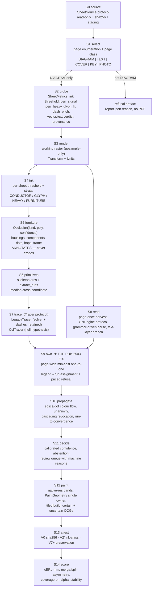

# wirecolor v4 — Decision Document

**Status:** DECIDED. Implement from this document.
**Date:** 2026-07-20
**Supersedes:** the R7–R16 tuning method. Does not supersede `AGENTS.md` (work rules) or the batch safety contract.
**Codename:** **NATA** — *Never destroy · Assign globally · Trace as measured · Attest always.*

---

## 1. Decision

wirecolor v4 restructures `pipeline.run_page` into fourteen typed, independently callable stages threaded by an explicit `RunContext`, and makes four inversions: **(1)** nothing may destroy conductor ink before tracing — label boxes, housings and inline components become annotated `Occlusion` regions with a bridging cost, never mask holes; **(2)** legend→conductor ownership becomes one page-wide min-cost one-to-one assignment instead of per-label nearest-neighbour, which is the fix this codebase already diagnosed in writing at `multiscale.py:576-584` and then declined to build; **(3)** every score is recomputed as merge-asymmetric error-free run length in page millimetres over *rendered* paint, with human-authored negative ground truth, and every migration phase is gated on it against the existing corpus; **(4)** the sheet describes itself — page class, ink threshold, pen width (bimodal), glyph height and dash pitch are measured per sheet and the engine's thresholds are expressed in those units. **The detection core — `detect/dashes.py` and `detect/solver.py`, 2,043 lines — is retained and re-hosted, not deleted.** It is put behind a `Tracer` protocol alongside a ~120-line AMSnet mask-then-CCL null hypothesis, and it is deleted only if and when the null hypothesis beats it on the new metric.

**The core bet:** *the four lost routes on pub 2503, and the R7–R15 tuning treadmill, are ownership and measurement failures — not tracing failures — and this project's own written record says so.* `HANDOFF.md:236-241` states it verbatim: *"the new geometry is correct, but the full multiscale ownership pass merged or quarantined one physical dash root and left real sections black."* All three Round-16 fixes that moved checkpoints 38→44 were evidence/ownership fixes. Zero were tracing fixes. We therefore rebuild the layer that failed and instrument the layer that did not, instead of rewriting 2,043 lines of tracer against a hypothesis the repo already contradicts.

---

## 2. Why this and not the alternatives

### 2.1 Why not the mask-then-CCL tracer rewrite (CONDUIT / FILAMENT / STRAND S4)

Four of the five surveyed proposals delete `detect/dashes.py` and `detect/solver.py` and replace them with connected-component labelling plus per-junction optimal assignment. All three correctness reviewers independently found the same class of defect, and the code confirms every one:

1. **A dashed conductor has no connected component.** `profile.py` records pub 2503's measured rhythm as pitch 44.5 px / stroke 11.0 px over 384 periods. CCL on that conductor yields roughly one stub per dash stroke. Every lost route on 2503 is a dashed heavy cable (`70 SB`, `70 R`, `25 R`). The entire dashed channel collapses into whatever single "gap bridging" clause the proposal writes — which is strictly less capable than the 1,408 lines it replaces, on exactly the routes that motivated the rewrite.

2. **Perfect matching cannot express a junction dot.** `detect/solver.py:30-33`: *"junction dots CONNECT everything they touch: all arcs ending at a dot belong to the same cable (that is what the filled dot means) — e.g. a star point's branches or a daisy-chained injector return."* That is a 1→N electrical relation. A matching forces pairing and orphans the third leg. The existing solver deliberately excludes `at_dot` ports from the pairing graph and takes connectivity from union-find instead; the CCL proposals delete that distinction and offer nothing in its place.

3. **CCL merges across splices by construction.** `detect/solver.py:147-150`: *"a splice joins distinct physical cable pieces whose colours may differ. Real splice dots are therefore hard colour boundaries."* A splice is geometrically a collinear stub pair. Mask-then-CCL re-merges it before any colour information exists. That undoes commit `b3c71f3` (spliced continuations) in the first tier of the replacement, and produces a merge across a colour boundary — the worst output this product can emit.

4. **`colors_ok` is a hard veto that assignment cannot reproduce.** `detect/solver.py:133`: two nets with disjoint seeded colour sets can never union. Replacing a categorical constraint with an additive cost term means a sufficiently attractive geometric score can buy a colour-incompatible join. On the proposals' own metric (merge = build failure), that is a net regression.

5. **The arithmetic does not work.** `scipy.optimize.linear_sum_assignment` on a symmetric k×k cost matrix does not return an involution; at a 3-stub T it can return the 3-cycle *i→j, j→k, k→i*, which union-find collapses into one net. Non-bipartite pairing needs blossom matching, not "one scipy call".

### 2.2 Why not "keep tuning"

R7–R16 produced 228 tuned constants in one 1,408-line file with no convergence criterion, and there is no test that fails when a constant is moved to a nearby value. Marginal precision on the tuned sheet is bought with unmeasured recall on the other ~139 publications. That method is not continued.

### 2.3 Why not renormalize the render by DPI

Three proposals normalize by re-rendering the page so the measured pen lands on a fixed value. Two independent flaws kill it as specified: the formula `clamp(probe_dpi × TARGET/measured, 150, 400)` is one-directional (a 12–16 px legacy pen clamps at the floor and is never normalized — the exact motivating case), and **you cannot thin a heavy pen by rendering lower, because the glyphs go with it.** Worse, any change to the render invalidates the OCR memo wholesale (`instrument.py:52-56` discards the whole store on a page-hash mismatch), which is a ~280 CPU-hour cold re-OCR on one VM.

v4 normalizes **units, not the render**: constants become multiples of measured `pen_signal` / `pen_heavy` / `glyph_h` / `dash_pitch`, and the render is changed in exactly one direction — **upsample-only, when `pen_signal < 2.0 px`** — because skeletonizing a sub-2 px line is unreliable and rendering higher is lossless. This preserves the memo on the overwhelming majority of the corpus and bounds the cold cost to a measurable minority.

### 2.4 The strongest counterargument to our own choice

**We are keeping 2,043 lines and roughly 320 tuned constants whose value has never been measured against a cheap baseline, and we are therefore capping the universality claim at whatever `dashes.py` can do.** If a 120-line CCL tracer scores within noise of the hand-tuned solver, we are maintaining an entire subsystem for nothing, and every subsequent phase inherits its 200-DPI assumptions.

That objection is correct, and it is answered by sequencing rather than by argument: **P1 runs the CCL null hypothesis as a scored competitor behind the same `Tracer` protocol, on the same corpus, with the same metric, before P2 begins.** If it wins, `dashes.py` and `solver.py` are deleted in P2 on measured evidence. If it loses, we have finally bought the quantified justification for their complexity that has never existed. The decision this document makes is not "the solver is good"; it is **"we do not delete before we measure, and the measurement is cheap."**

A second real cost: retaining the tracer means P4's unit migration must rewrite ~320 constants inside a module we did not author from scratch, gated on bit-identical output. That is grinding work. We accept it because the alternative is a blind rewrite whose failure mode is silent merges.

---

## 3. Target architecture

### 3.1 Data flow



`RunContext` (frozen dataclass: `units`, `profile`, `ocr_memo`, `diag`, `reader`, `paths`, `policy`) is threaded through every stage. No module-level singletons.

### 3.2 Stage table

| # | Stage | Concrete algorithm | Synthesizes | Replaces |
|---|---|---|---|---|
| **S0** | `source.py` | `SheetSource` Protocol: `list() -> [SheetRef]`, `open(ref) -> path`, `sha256(ref)`. Implementations: `SqliteLibrarySource` (today's read-only URI + `local_path` query), `FileSource`, `DirectorySource`, `SyntheticSource`. `SafetyPolicy` with a **non-overridable** `assert_sources_unchanged`. Containment via `os.path.commonpath` over `os.path.normcase(os.path.realpath(...))`. Typed `SafetyViolation`, never `SystemExit` from library code. | The existing `batch.py` contract, generalized | `batch.py:31-37,48-50,53-79`; `tools/p1_run.py:18-19,47-52`; `tools/golden_p0.py:29-30,39` — three copies of `DB`/`BASE` and the inline `SELECT` |
| **S1** | `select.py` | **New.** Enumerate every page of a publication; classify each OCR-free from `get_drawings()` stroke count, `get_images()`, text-layer char count and `measure_page` ink stats: `DIAGRAM` (ink_fraction 0.01–0.25, long-run count high, text clusters distributed), `TEXT_PAGE` (text_area_fraction > 0.35), `COVER`, `KEY_LEGEND` (dense small symbol blobs, few long runs), `PHOTO`. Only `DIAGRAM` proceeds. Emits `SheetIndex` per publication. | — (a gap nobody proposed) | `batch.py:186` `--page` default 0 applied to every publication in the run |
| **S2** | `metrology.py` | `SheetMetrics` frozen dataclass. Ink threshold from the grey-histogram valley (triangle/Otsu) replacing four `<210` copies. **Bimodal pen**: `pen_signal` = parabolic-interpolated mode of the ink-run-length histogram, `pen_heavy` = p90 — the corpus is demonstrably bimodal (2503: signal ~3 px alongside 70 mm² cables). `glyph_h` from glyph-class CC medians. `dash_pitch`/`dash_stroke` by 1-D autocorrelation of the ink profile along long thin components, cross-checked against `profile.dash_rhythm`. Vector verdict from **`len(get_drawings())` on the DIAGRAM page**, not from text chars. Ghostscript-producer provenance stamped from `audit_wiring_originals` logic. | `tools/corpus_census.measure_page`, `profile.py`, Digitize-PID kernel measurement | `prep.py:13` `WORKING_DPI` as an invariant; `corpus_census.py:114`'s `text_chars > 200 and images == 0` verdict; `corpus_census.py:110`'s dead `meta.get("width")` |
| **S3** | `render.py` | Working render at 200 DPI **unless** `pen_signal < 2.0 px`, in which case re-render at `200 × 3.0 / pen_signal` snapped to a 25-DPI grid (upsample-only). `Transform` kept verbatim from `prep.py:46-66`. `Units` object resolves `Q(pen=…, heavy=…, glyph=…, pitch=…, mm=…) -> px`. `WORKING_DPI` becomes a field of `SheetMetrics`. | `prep.py`'s working/native split, generalized | `prep.py:13` as a module constant |
| **S4** | `ink.py` | Per-sheet binarization at the S2 threshold. Connected-component + stroke-width classification into `CONDUCTOR` / `GLYPH` / `HEAVY` / `FURNITURE`. **`HEAVY` is a label, not a deletion** — the `distance_to_background > 6.0` cut (`pipeline.py:717-726`) currently removes exactly the battery/starter cables the tool exists to trace. `FURNITURE` = CCs connected to the page frame (the frame being the longest 2 H + 2 V ink runs), replacing `EDGE_BAND = 120` and `dots.py:29`'s `(cx > 0.62W and cy > 0.70H)` title-block rectangle. | AMSnet's mask-components step *as classification*; CGHD's first-class annotated classes | `pipeline.py:717-726`, `pipeline.py:835-841`, `detect/dots.py:29`'s page-fraction logo rule |
| **S5** | `furniture.py` | `Occlusion(kind, poly, confidence, evidence)`. Housing/component/dot/hop/twist detectors keep their current evidence logic but **lose the power to delete pixels**. The tracer sees an occlusion as a corridor with a traversal cost rising with width and falling with collinearity; the painter sees it as a knockout. A false-positive housing now costs a little instead of severing a conductor forever. Wire **hops become annotated objects** with a `must_link` constraint on the collinear pair. | CGHD schema; DFKI "detect hops, remove them, let connectivity fall out" — as a constraint, not a hole | `detect/skeleton.py:16-20` (`build_wire_mask` erasure), `detect/components.py:26-32` (`cut_inline_component_zones`), `pipeline.py:647-686` housing synthesis with erase power |
| **S6** | `primitives.py` | Skeletonize the `CONDUCTOR` stratum; cut at branch pixels with radius `Q(pen=1.5)`; `order_arc` kept. **`detect/runs.extract_runs` finally wired in**, fed `pen_heavy` — today it has zero callers outside its test file, despite being the only scale-free module in `detect/` and despite documenting the measured phantom-position bug it fixes (bent arcs reporting a conductor where there is no ink). | `detect/runs.py`'s own design contract | `detect/skeleton.py` as the sole atom; the phantom arc-mean positions used in ownership |
| **S7** | `trace.py` | `Tracer` Protocol → `(claims: {si: (d2, codes)}, dgroups: {root: [si]}, nets)`. **`LegacyTracer` wraps the retained `detect/solver.solve` + `detect/dashes.solve_dashes` unchanged.** `CclTracer` (~120 lines, scored null hypothesis): mask occlusion bboxes, disc-mask `Q(pen=2.5)` at branch clusters, CCL, re-merge collinear stubs. The `dash_sol` duck-typed clone is deleted: both channels now return the protocol type directly. | AMSnet 2.0 as a *baseline*, not as the core | `pipeline.py:874-895` `dash_sol`; `pipeline.py:870-873`/`917-931` the dual claims conversions; `pipeline.py:731-774` the double detection pass |
| **S8** | `read.py` | Page-once tiled harvest (`labels/harvest.py` kept) is the **only** path — `_reocr_region` is deleted. `OcrEngine` Protocol (RapidOCR default; PaddleOCR / Surya as A/B). Memo key extended to `(page_sha, window, rotation, engine_id, engine_version)` so an engine A/B **extends** the cache instead of wiping it. **Text-layer branch**: if the DIAGRAM page carries extractable text, legends are read exactly from `get_text("words")` with exact boxes and no OCR at all. Parsing is grammar-driven from the profile. | Digitize-PID's explicit text stage; WireViz's concatenated IEC codes as the grammar stress case | `pipeline.py:40-97`; `pipeline.py:571` vs `575-582` (the two divergent `reocr` paths); the four `_strong_label` copies (`pipeline.py:96-98`, `multiscale.py:17-19`, `solver.py:167-170`, `dashes.py:57-60`); `parse.py:21,24-27,97` |
| **S9** | `own.py` ★ | **Page-wide min-cost one-to-one assignment** between accepted legends and conductor `Run`s (`scipy.optimize.linear_sum_assignment`, rectangular, with a dummy "owns nothing" column priced at `REFUSE_COST`). Cost = `w1·perp_offset/glyph_h` + `w2·(1 − side_agreement)` (against the sheet's own voted legend side/offset, already measured and never fed back) + `w3·alongside_penalty` + `w4·gauge↔stroke-width mismatch` (a `70` legend must not land on a one-pen fragment — this term alone kills the `70 SB` confiscation class) + `w5·occlusions_crossed` + `w6·(1 − end_to_end_corroboration)` (the same code printed at both ends of a conductor is free evidence nobody uses). Labels get stable content-derived ids `(raw, cx, cy, page_sha)`. | Digitize-PID's line↔text association; **the repo's own recorded dead end at `multiscale.py:576-584`**, honoured rather than re-derived | `multiscale.py`'s `scene_*` protocol (9 silent switches), its nearest-neighbour claim path, `pipeline.py:465-520` `resolved_label_ids` + `id(label)` as a cross-stage token, `dashes.py:463-665` ad-hoc seeding, the four tie-break margins (10/10/12/18) |
| **S10** | `propagate.py` | Colour flow across dots and splices. **Semantics preserved verbatim**: `frozenset(code parts)` compatibility (`'BL/R' == 'R/BL'`, `'R' != 'R/BL'`), unanimity-only adoption, cascading revocation, splice dots as hard colour boundaries. Rewritten as a pure function with a convergence assertion, replacing every `range(4)/range(8)/range(12)/range(20)/range(80)` cap. | `solver.py:133-158`; the four existing "black beats wrong" mechanisms unified into one | `pipeline.py:393-462`, `pipeline.py:1061-1120`, `multiscale.py:576-589` |
| **S11** | `decide.py` | Commit a colour only above `tau`, calibrated on the cERL/merge curve. **Hard abstention overrides** regardless of score: two accepted legends disagree; `LegacyTracer` and `CclTracer` disagree about this conductor; the sheet is a metrology outlier (>6 MAD from corpus priors, promoted from advisory to load-bearing); the profile scored below margin. Every abstention written to `abstentions.json` with a machine reason from `route_probe`'s taxonomy. | ERL's merge>split asymmetry as a runtime rule; `route_probe`'s vocabulary promoted to labels | The scattered silent `continue`s that turn ambiguity into an unlogged lost route |
| **S12** | `paint.py` | Mechanism kept verbatim — bands onto a copy of the native render so anti-aliasing blends against real artwork, then cut RGBA via the coverage mask and zero the colour plane outside it. Changes: band width and gaps become `Q(pen=…)`; **one `PaintGeometry` dataclass owns `PROTECT_MARGIN`, imported by both painter and validator** (today painter knocks out `TERM_GAP + 12 = 21`, validator re-measures `TERM_GAP = 9`); tiled build bounds peak memory; **two OCGs** — `Wire colors` (committed) and `Wire colors (uncertain)` (hatched, below `tau`); a `/EngenhariaNata` provenance key in the document Info dict. | The existing `raster_overlay.py` overlay trick — the reason an A0 sheet is a few MB instead of a 557 MB append | `paint/legacy.py:70-92` `paint_legacy`; `raster_overlay.py`'s scattered `* t.s` radii; the unbounded canvas at `prep.py:78-81` |
| **S13** | `attest.py` | **V0** source sha256 unchanged, promoted into the validator list so it appears in every report. **V7+** kept verbatim in all three sub-checks including both MuPDF workarounds (fresh handle before page access; `fitz.TOOLS.store_shrink(100)`), with one hardening: **`render_checked == False` is a FAIL**, and V7 gets its first unit tests. **V2′** replaces V2: overlay alpha may sit only on pixels the S4 atlas calls `CONDUCTOR` (dilated by the band half-width) — alpha on glyphs, `HEAVY` blobs, `FURNITURE`, title blocks or housing interiors fails. V2 as written cannot fail. | The repo's own V7 — the product's real differentiator | `verify/validators.py:23-44` (V2); `validators.py:81-100` (the silent-skip path) |
| **S14** | `eval/` | cERL-mm, merge/split counters, coverage-on-alpha, `longest_unpainted`, abstention histogram, achievable-ceiling, determinism and **stability** (re-solve with seed order reversed; conductors whose colour flips are flagged). All computed **offline** from `diag/arcs.json` + the rendered RGBA. | Connectomics ERL; `profile.paint_coverage`; `route_probe`'s taxonomy | `tools/route_audit.py:30-38`; the 16-vs-25 px dual radius; `profile.py:131`'s claims-based coverage; `tools/golden_p0.py` as an acceptance gate |

---

## 4. The universality boundary

### 4.1 The rule

`engine/` — stages S3–S7, S9–S12 — **may not import `profiles/` or `labels/`**. It receives `Units`, `SheetMetrics` and a `Profile` dataclass as arguments. A CI import-graph test fails the build if that edge appears. **The string `volvo` appears nowhere under `engine/`** — only in `profiles/volvo_classic/`, in a corpus adapter, and in test fixtures.

Second rule, enforced by an AST lint over `engine/`: **no bare numeric literal outside a whitelist of pure ratios and small integers.** Every geometric threshold is a `Q(...)` expression. (This is enforcement of *form*, not of correctness — it does not stop a wrong coefficient; it stops a hidden DPI assertion.)

### 4.2 What is engine and what is profile

| Engine (code) | Profile (data) |
|---|---|
| Skeletonization, CCL, run extraction, assignment solvers, union-find, colour propagation, painting, preservation, scoring | Colour token → RGB table |
| Occlusion cost model and matching topology | Label grammar (separator, token length, max parts, gauge vocabulary + unit + mandatory flag, circuit-id pattern, **strength predicate**) |
| Metrology estimators (pen, pitch, glyph, threshold) | Symbol templates (housing, dot, hop, splice, inline component) with per-template match thresholds **in `Q` units** |
| Page classifier features | Page-class thresholds and corpus priors (median + MAD) |
| Abstention machinery | `tau` floor and the profile-selection margin |

Everything measured from the sheet (DPI, page size, pen weight, dash pitch) needs **no profile entry at all** — S2 measures it.

### 4.3 Shape of a profile bundle for a new manufacturer

```
src/wirecolor/profiles/cat_awg/
├── profile.json
├── grammar.json
├── symbols/
│   ├── housing_rect.png
│   ├── junction_dot.png
│   ├── hop_arc.png
│   └── thresholds.json
└── priors.json
```

`profile.json`:

```json
{
  "name": "cat_awg",
  "description": "US harness convention: AWG gauges, SAE colour abbreviations, no printed gauge on signal wires.",
  "tokens": {
    "BLK": [25, 25, 40], "WHT": [255, 255, 255], "RED": [225, 30, 30],
    "GRN": [0, 165, 60], "YEL": [240, 210, 0], "BLU": [0, 110, 210],
    "ORG": [240, 130, 0], "BRN": [110, 60, 25], "PPL": [140, 50, 175],
    "GRY": [140, 140, 140], "PNK": [235, 120, 190], "TAN": [195, 155, 95]
  },
  "white_token": "WHT",
  "distinctive": ["BLK", "WHT", "PPL", "GRY", "TAN", "PNK", "ORG"],
  "excluded_from_evidence": [],
  "shared": ["GRN", "BRN"],
  "all_white_rule": {"mode": "code_census", "min_share": 0.85, "min_distinct_codes": 2}
}
```

`grammar.json`:

```json
{
  "separator": "-",
  "separator_may_be_empty": false,
  "token_len": [3, 3],
  "max_parts": 2,
  "gauge": {"unit": "AWG", "vocabulary": [22,20,18,16,14,12,10,8,6,4,2,1,0], "mandatory": false},
  "circuit_id_pattern": "\\[C[0-9]+\\]$",
  "templates": [
    {"name": "gauge_first", "regex": "^(?P<gauge>\\d{1,2})\\s+(?P<code>[A-Z]{3}(?:-[A-Z]{3})?)$"},
    {"name": "code_only",   "regex": "^(?P<code>[A-Z]{3}(?:-[A-Z]{3})?)$"}
  ],
  "strength": {"any_of": [["gauge", "code"], ["code", "circuit_id"]]}
}
```

The `strength` declaration is the key generalization. Today `_strong_label` is hardcoded four times as *"contains a digit or a slash"* — a Volvo drafting habit. On a manufacturer that prints bare colour codes, **every label on the sheet is weak** and the tool paints nothing. Here a bare `RED` is weak, but `RED [C12]` is strong.

`symbols/thresholds.json`:

```json
{
  "housing_rect": {"ncc": 0.72, "min_size_q": {"pen": 6}, "max_size_q": {"pen": 110}},
  "junction_dot": {"ncc": 0.80, "radius_q": {"pen": [1.2, 3.0]}, "fill_min": 0.75},
  "hop_arc":      {"ncc": 0.68, "span_q": {"pen": [3, 12]}}
}
```

`priors.json` carries median + MAD for `pen_signal`, `dash_pitch`, `legend_offset`, `ink_fraction`, `arc_length`. For manufacturer #2 it starts empty; the engine then runs with a **raised `tau` and mandatory review** until 10 sheets have been confirmed, and the priors are written from those. This is the honest answer to "you cannot have priors for a manufacturer you have never seen".

### 4.4 Selection

`--profile auto` is the default. Every registered profile is scored against the harvested token census: `distinctive_hits × grammar_parse_rate × gauge_vocab_hit_rate`. The winner must beat the runner-up by a declared margin or **the sheet is refused for review, never painted with a guess**. `validate_disjointness()` — today an uncalled function — becomes a startup assertion, which is what makes that scoring well-posed. The current `--convention volvo_classic` defaults in four runners and the hardcoded `load_convention("volvo_classic")` at `golden_p0.py:140` are removed.

### 4.5 Honest scope statement

**"A new manufacturer is one JSON bundle" is true for the colour lexicon, the label grammar, the symbol set and the priors. It is not true for a manufacturer that expresses wire colour in a table keyed by circuit id rather than beside the conductor** — that requires a new S8/S9 association mode (`table_lookup`), which is engine work. `profile.json` declares `"label_placement": "alongside"` so that gap is explicit rather than discovered. P0 measures how many corpus sheets use a table.

---

## 5. Measurement

### 5.1 Primary: cERL-mm

For each ground-truth conductor with a dense polyline:

1. Resample the polyline every `max(2·pen_heavy, 12 px)` at working scale — that spacing is the **markup tolerance**, declared as `tolerance_px` in the route file and stamped into every score. It is derived from the sheet, but it is *not* `1.5 × pen`: hand-drawn markup carries human precision of 10–25 px, and a 4-px tolerance would measure the annotator's mouse, not the engine.
2. Assign each sample the id of the nearest **painted conductor** within tolerance. If no conductor of *any* colour is within tolerance → `NO-CONDUCTOR`. **If a conductor is present but the sample lands in a dash gap, snap to the conductor's polyline — a dash gap is not a failure.** (This alone reclassifies 2 of pub 2503's 6 open checkpoints: routes 10 and 12 report `NO-ARC` at the engine-body end, and `HANDOFF.md:311` already flags that the checkpoint may sit in a dash gap.)
3. Walk from the route start. The run ends at the first of: id changes (**SPLIT**), id becomes `NO-CONDUCTOR` (**COVERAGE LOSS**), painted colour ≠ expected code (**WRONG-COLOUR**), no colour (**BLACK**).
4. `ERL_route = arclength_before_first_error / total_route_length`, reported in **page millimetres** as well as fraction, so numbers are comparable across DPI and page size.
5. `cERL_sheet` = length-weighted mean over routes. `cERL_corpus` = **median over sheets**, so one pathological sheet cannot be tuned away by helping 139 others.

### 5.2 The merge/split asymmetry, made concrete

**A merge is not "two ground-truth routes share a root".** Routes 04, 08, 13 and 15 on pub 2503 all meet at *junction box +/−*; a shared net there is physically correct. Folding that into a hard gate would fire on noise on day one and get loosened — the exact R7–R15 gradient.

> **MERGE := two routes explicitly declared `distinct` in the route file share one painted conductor id.**
> `distinct` pairs are **human-authored negative ground truth**. There is none today, and it is the only way a merge is expressible at all.

| Event | Cost |
|---|---|
| **SPLIT** | Linear. The run truncates; the remaining length is lost ERL. Nothing more. |
| **BLACK / COVERAGE LOSS** | Same as a split. "Black beats wrong" is encoded in the metric, not only in the code. |
| **ABSTENTION** | Split + ε (ε = 0.02 of route length), so the engine is not rewarded for refusing everything. |
| **WRONG-COLOUR** | Truncates the run **and** increments `wrong_colour_events`. |
| **MERGE** | Truncates **both** routes to zero ERL **and** increments `merge_events`. |

`merge_events == 0` is a **hard release gate**, reported alongside `cERL_corpus` — **not multiplied into it**. A multiplicative `0.5^merges` collapses to ~1e-9 at 30 merges and has no gradient in the regime a change starts in. Two numbers, one gate.

### 5.3 Secondary gates (all reported jointly; a merge rate without a coverage number is inadmissible)

- `painted_ink_fraction` — rendered alpha ∩ `CONDUCTOR` stratum ÷ `CONDUCTOR` stratum, measured **downstream of end-trim, the short-arc filter and every knockout**. `profile.py:131` counts claims and over-reports by an unmeasured margin.
- `achievable_ceiling` — conductor ink within one legend span of an accepted legend ÷ all conductor ink. **Without this, no coverage number is interpretable**: "half the page black" may be the correct output.
- `longest_unpainted` with coordinates — kept verbatim from `profile.py:140-144`; it is what caught "44/50 routes but half the page black".
- `must_not_paint` violations — 0 required.
- `abstention_rate` with a reason histogram, reported separately from "never traced".
- `stability` — re-solve with seed order reversed; fraction of conductor length whose colour changes. Needs no ground truth, runs on every staged sheet today.
- `determinism_sha` — two runs must produce an identical conductor-id map.
- `crash` is a distinct outcome from `low_score`. `batch.py` currently swallows any exception into `passed: False`, so a refactor that turns a crash into a silent bad run looks like an improvement.

### 5.4 Gates that void the score entirely

V0 (source sha256 unchanged), V2′, V7+ with `render_checked == True`. A sheet failing any of these has **no score**, not a degraded one.

### 5.5 Retroactive re-scoring of R7–R15

This is cheap and it is mandatory, because every historical claim was made under a metric that passes a checkpoint when *any* arc within 16–25 px carries the expected code — so a correctly-painted neighbour rescues a lost conductor, and a solver that fused every `R` conductor into one net and every `SB` into another scores 50/50 checkpoints and 15/15 routes.

**Procedure** (`tools/score_history.py`, ~120 lines):

1. `git worktree add` each of the R7…R16 commits (`b3c71f3`, `648c232`, `e60aa1b`, `62b54a8`, `c590346`, and their predecessors) into a scratch tree.
2. For each, run `corpus_replay` against the **frozen staging OCR memos**. The memo stores raw pre-parse engine tokens keyed to the page render, which is unchanged across all those commits — so each round replays in ~3 min/sheet instead of ~2 h, and the recognised text is byte-identical to what that round actually saw.
3. Score every resulting `diag/` with the v4 scorer.
4. Emit `history.json`: per round × per sheet — `cERL`, `merge_events`, `wrong_colour_events`, `coverage`, `abstention_rate`.

**What this buys.** It tells us, for the first time, whether the R16 gain of 38→44 checkpoints was an ERL gain or a metric artifact, whether any round bought its sheet at the cost of merges elsewhere, and which of the eleven-plus `round N` / `pub NNNN` guards actually moved a number. **Guards that moved nothing become deletion candidates with evidence.** Guards that moved a number become named, fixtured rules.

**Expected and accepted:** pub 2503's headline number will *drop* when the PASS rule tightens to the checkpoint's own nearest conductor. That drop is measurement correction. It is recorded as the new baseline and is not "fixed" by loosening the metric again.

### 5.6 Ground-truth authoring — the budget nobody costed

The metric requires dense per-conductor polylines plus `distinct` pairs and `must_not_paint` regions on 10–12 diverse publications. Today there is **one** route file, 15 routes, 50 checkpoints, most routes 2 points.

- **Tool:** the existing pink-markup workflow (`markups/...markup1.pdf` → `tools/ground_truth.import_markup`). v4 extends the importer to accept (a) **dense** polylines instead of `sample_path(spacing=260, limit=6)`, (b) a **second markup colour** encoding `distinct` pairs, (c) a **third** for `must_not_paint`.
- **Independence:** `ground_truth.legends()` currently sources expected colours from the pipeline's own accepted-evidence dump — the metric inherits the system's own legend misreads and confirms them. **v4 requires the colour of every route to be transcribed by a human from the sheet**, and `status: confirmed` becomes a hard filter (`route_audit.py:65` and `batch.py:164` both iterate routes wholesale today).
- **Cost:** ~45–90 min per sheet for a domain-literate annotator. 12 sheets ≈ 12–18 hours. **Scheduled explicitly in P0 and P1, not assumed.**

---

## 6. Migration plan

Each phase is independently shippable and independently valuable. Each "proves" gate is measured against the **existing** staged corpus on the homelab VM.

---

### P0 — The ruler *(no engine change at all)*

**Work**
- Build `eval/`: cERL-mm, merge/split counters (`distinct`-pair based), coverage-on-alpha, `achievable_ceiling`, abstention histogram, stability, determinism, crash-vs-low-score. Computed **offline** from existing `diag/arcs.json` + rendered RGBA.
- Rewrite `route_audit`'s PASS rule to *the checkpoint's own nearest conductor carries exactly the expected code*; add dash-gap snapping; collapse the 16-vs-25 px split into one sheet-derived, route-file-declared tolerance.
- Extend the route schema: dense polylines, `distinct` pairs, `must_not_paint` regions, `status: confirmed` enforced by every consumer.
- Author dense ground truth on **pub 2503 + 5 diverse publications** (the human-labour item above), with human-transcribed colours.
- Fix `corpus_census.py:110` (`page_pt: [0,0]` on every record) and give it `--db`/`SheetSource`.
- **Corpus census answers, run once, before anything is designed around them:**
  (a) **page counts and page classes** across the library — how many pages per wiring publication, how many are `DIAGRAM`;
  (b) **vector fraction from `len(get_drawings())` on the DIAGRAM page**, cross-tabulated with Ghostscript-producer provenance from `audit_wiring_originals`;
  (c) **text-layer fraction on the DIAGRAM page** (note: `audit_wiring_originals.py` already records that *"the raster foldouts themselves have no text layer"* — so the current census verdict, keyed on `text_chars > 200`, is almost certainly measuring the TOC, not the diagram);
  (d) **how many sheets currently complete end-to-end** — read `index.json` — plus crash count and wall-clock for one full pass;
  (e) how many sheets print wire codes in a **table** rather than alongside.
- Freeze `scoreboard-baseline.json` + a **corpus manifest** (per-sheet source sha256 + page index + provenance) and a **build manifest** (git rev, config hash, profile version).
- Run `tools/score_history.py` over R7–R16 (§5.5).
- **Ship `render_checked == False` → FAIL in `v7_preservation` now.** One line; it guards the only thing between this tool and destroying originals, and it has zero tests today.

**Proves** — every staged sheet has an honest score for the first time, including the merge count nobody has ever seen; the vector/text/page-class questions are answered before any architecture depends on them; R7–R16 has a real per-round ERL curve. **Two of pub 2503's six open checkpoints (routes 10, 12) are reclassified here** as dash-gap metric artifacts or confirmed as real defects.

---

### P1 — Contracts, context, packaging, and the null hypothesis *(behaviour bit-frozen)*

**Work**
- Typed stage contracts (`SheetRef`, `SheetMetrics`, `Units`, `InkAtlas`, `OcclusionSet`, `Primitive`, `Conductor`, `Decision`, `PaintPlan`) and `RunContext`. Split `run_page` by **pure extraction only** — no logic change, no reordering.
- Delete `_ENGINE`/`_MEMO`/`_DIAG` globals and `reset_for_tests()` as the production rebind.
- `SheetSource` + `SafetyPolicy`; NTFS-correct `commonpath` containment; typed exceptions replacing the seven library-level `SystemExit`; `logging` + a progress callback replacing 60+ bare prints.
- `pyproject.toml` with the **actual** dependency set (**`scikit-image` is imported at module load in `detect/skeleton.py:10` and declared in no requirements file**; `rapidocr` only in the optional file), a `wirecolor` console script, a LICENSE, and version discipline (`__init__.py` still says `2.0.0-p0`).
- Harvest becomes the only OCR path (`batch.py:114` silently takes the ~2 h path while `p1_run` takes the ~3 min one).
- Delete `__main__.py`'s delegation to `tools/p0_run.py`; move `golden_p0.py` into `tests/` as a labelled legacy-drift smoke test with **no acceptance authority**.
- Wire `colorize_wiring_prototype.py` (1,053 lines, **present on the dev machine**) in as a laptop-runnable disagreement oracle. The survey's claim that the v1 oracle is unavailable is false.
- **Land `CclTracer` behind the `Tracer` protocol and score it against `LegacyTracer` on the P0 baseline, sheet by sheet.**

**Proves** — corpus replay produces **byte-identical `arcs.json` and identical cERL on every staged sheet**; two sheets run concurrently in one process without cross-contaminating the memo; a clean machine installs from the manifest. And the number that decides P2's scope: **does a 120-line CCL tracer match 2,043 hand-tuned lines?**

---

### P2 — Stop destroying ink

**Work**
- `InkAtlas` + `OcclusionSet` replace `build_wire_mask`'s erasure (`skeleton.py:16-20`), `cut_inline_component_zones` (`components.py:26-32`) and housing synthesis's erase power (`pipeline.py:647-686`).
- `EDGE_BAND = 120` and the `distance_to_background > 6.0` thickness cut become **evidence-gated `HEAVY`/`FURNITURE` classifications**, not deletions.
- Delete `dashes.py:941-1008` `_strong_label_gap` — a 70-line, 12-constant repair for damage the pipeline inflicts on itself — **only if** the occlusion-corridor cost reproduces or beats its recall. Keep it behind a flag for one phase if not.
- Remove the `d <= 240` cap on the `dash_mate` diagnostic (`dashes.py:1018`): the regime it reports on runs to 600, so the widest and most interesting refusals leave no trace today.
- Add a `route_destroyed_before_trace` counter. Every surviving exclusion becomes a logged, reversible diag record.
- **If P1 showed `CclTracer` ≥ `LegacyTracer`: delete `detect/dashes.py` and `detect/solver.py` here, after converting every `round N` / `pub NNNN` guard into a named, fixtured rule.** Otherwise they stay.

**Proves** — `route_destroyed_before_trace` → 0 corpus-wide; cERL up or flat on every sheet; `merge_events` not up. Every residual lost route becomes **attributable**: split, merge, ownership rejection or OCR misread. This is where "never traced" and "traced and refused" stop being indistinguishable.

**Risk owned:** never erasing glyph ink means text physically contiguous with a conductor becomes a skeleton branch. Mitigation: `GLYPH`-class pixels are excluded from *connectivity* while remaining in the atlas — classification, not deletion, and the difference from today is that a **false** OCR box no longer cuts a real conductor. The `find_twist` text-remnant filter (`skeleton.py:88-102`), which currently tests whether a short arc's midpoint lies inside an erased label box, is re-expressed against the `GLYPH` stratum.

---

### P3 — Ownership as global assignment ★ **RECOVERS PUB 2503**

**Work**
- Land `own.py`: page-wide min-cost one-to-one legend↔run assignment with a priced refusal column and the gauge↔stroke-width term.
- Delete `multiscale.py`'s `scene_*` protocol, `competing_scenes`, and `resolved_label_ids`/`id(label)`. Keep the persistent page-scene / read-only-zoom-lens model.
- Retain S10's propagation semantics verbatim; assert convergence.
- Ship with a **per-sheet claim-diff report** against P2, not only an aggregate score.

**Proves** — the recorded negative result at `multiscale.py:576-584` **reverses**: rejections fall *and* coverage rises simultaneously, which independent nearest-neighbour provably could not achieve (139→7 rejections but coverage 52.3%→50.6%, unresolved 1→4). Concretely: **pub 2503 routes 06 and 08 — the four remaining real open checkpoints at (6900,4753), (7466,5000), (7537,4950), (7924,4500) — are recovered, with `merge_events` still 0 corpus-wide and no sheet losing >5% cERL.**

**Why this phase and not a tracer rewrite:** `HANDOFF.md:236-241` — *"Round 15 produced 36 / 29 / 1 unresolved. Therefore the new geometry is correct, but the full multiscale ownership pass merged or quarantined one physical dash root."* And `HANDOFF.md:250` — *"These failures appear only after full multiscale ownership, not in the new straight-through geometry test."* Both remaining failures are legends in a bundle, at ~40 px wire spacing with a ~40 px legend offset, which is exactly the case the code's own comment says requires one-to-one assignment.

**Risk owned:** this changes which legend wins a contested bundle on essentially every sheet — the same class of change that caused the `70 SB` confiscation. That is why P0's merge-aware scoring lands first and why the phase ships with a claim-diff.

---

### P4 — Units

**Work**
- `Units` threading; rewrite the ~500 pixel literals in `detect/`, `paint/`, `pipeline.py` as multiples of `pen_signal` / `pen_heavy` / `glyph_h` / `dash_pitch`, **one file per commit**, each gated on unchanged cERL.
- Classify each literal first (length / area / squared-distance / count / ratio / score) — this is **not** mechanical, and the plan does not pretend it is.
- Collapse the duplicate concepts to one owner: four dash-period windows, five "near a pin" radii, four ambiguity margins, four `<210` copies, two "long enough to be a wire" lengths (300 vs 60 on the same page), three `_strong_label` copies, the `TERM_GAP` vs `TERM_GAP+12` mismatch.
- Upsample-only re-render for sheets with `pen_signal < 2.0 px` (bounded memo invalidation, re-OCR cost measured and reported).
- Derive `PT_PER_PX` from the recorded page rect; delete the `0.36` literal at `ground_truth.py:23`, and **re-project any existing route file** rather than reinterpreting it (coordinates still parse at another scale, so the failure would be silent).
- Land the AST lint forbidding bare literals in `engine/`, file by file as each converts.

**Proves** — identical cERL at the corpus's own DPI, **and** identical cERL when 10 sheets are re-rendered at 300 DPI and 150 DPI. That second result is the resolution-portability claim, made before a second manufacturer exists, and it is impossible to run today.

---

### P5 — Profiles as data + a second convention

**Work**
- Split the profile bundle out of code (`profile.json`, `grammar.json`, `symbols/`, `priors.json`); wire the five dead `Convention` fields; grammar-driven parse in S8.
- `--profile auto` with refuse-below-margin; `validate_disjointness()` as a startup assertion.
- CI import-graph test forbidding `engine/` → `profiles/`.
- WireViz synthetic generator: YAML → coloured harness → colour-stripped mono input + exact per-conductor polylines and net identity. Sweep pen width, DPI, dash pitch, legend side, label density, injected scan noise.
- Fix `iec_two_letter.json`'s `all_white_token: "WH"`, which today would trip the whole-sheet paint kill-switch on a real IEC sheet — the previous data-driven-universality attempt shipped and silently died on exactly this.
- Run the OCR-engine A/B (RapidOCR vs PaddleOCR PP-OCRv5) — nearly free now that the memo key carries the engine id.

**Proves** — the whole Volvo corpus runs on `auto` and picks `volvo_classic` on every sheet with the declared margin; a synthetic IEC/AWG corpus with concatenated four-letter codes, a different separator and no metric gauges scores well **with zero edits under `engine/`**; the CI import test is green. Plus the first corpus that can legally ship and be shown in marketing — the ~140 Volvo Penta publications are copyrighted and cannot leave the VM.

---

### P6 — Vector and text-layer fast paths

**Work** — sized by P0's census answers; **jumps the queue if the vector/text fractions are large.**
- `VectorPrimitives` from `get_drawings()` on `DIAGRAM` pages: exact polylines, stroke widths, **dash arrays** — dashedness becomes a *read*, not an inference.
- Text-layer legend path in S8: exact strings, exact boxes, no OCR, no memo.
- Vector overlay: stroke PDF paths into the OCG instead of a PNG — lossless zoom, tiny file, trivially V7-clean (no image XObject added at all).
- Handle `native_image_info() is None` explicitly (`prep.py:34-43` returns `None` for vector pages and the downstream painter assumes raster).

**Proves** — near-ceiling cERL on those sheets, and a hard number for how much of the corpus was being solved by inference when exact geometry was available the whole time.

---

### P7 — Licence and product shell

**Work**
- **Spike first, in week one of P0** (see §10): can `pikepdf`/`qpdf` write a PDF *incremental update* that satisfies V7's byte-prefix check? qpdf rewrites files; `pypdfium2` has no incremental save. If not, the options are an Artifex commercial licence or a hand-written incremental-xref appender, and that decision must precede this phase, not follow it.
- Build a **dual-backend V7 parity harness** and prove identical byte-prefix / XObject-hash / layer-off verdicts across the whole corpus **before** the PyMuPDF path is removed.
- Migrate render to `pypdfium2`, incremental save + OCG to `pikepdf`.
- Tiled overlay build (four native-size arrays are live simultaneously today; the code itself records 558 MB for one A0 colour plane, and `native_canvas_size` has no cap).
- Ship `wirecolor trace --at x,y` — click-to-trace, everything else ghosted — reading the same `Conductor` graph.

**Proves** — zero AGPL in the dependency tree with V7+ passing on 100% of staged sheets; A0 sheets paint inside a 4 GB working set; a shippable mode whose failure is one visible wire the user can correct rather than one silent sheet.

---

## 7. What gets deleted

| File / region | LOC now | After | Note |
|---|---|---|---|
| `pipeline.py` — `run_page` (557-1175) + closures + `dash_sol` + the dash↔solid bridge + the twist/edge guards + `_reocr_region` + `resolved_label_ids` | 1,187 | ~200 | Becomes stage wiring. Every `round N` guard extracted to a named, fixtured rule **before** its host code is touched. |
| `multiscale.py` — `scene_*` protocol, `competing_scenes`, nearest-neighbour ownership, external `solution['seeds']` mutation | 678 | ~250 | Page-scene model kept; plumbing dies. |
| `detect/skeleton.py:13-21` `build_wire_mask` erasure | 122 | ~95 | Root cause of the gap-repair heuristic family. |
| `detect/components.py:26-32` `cut_inline_component_zones` + the 9-parameter Hough call | 192 | ~120 | Becomes template match + `Occlusion`. |
| `paint/raster_overlay.py` — loop-detour straightener, free-collinear bridge, ad-hoc `* t.s` radii | 481 | ~320 | Painter-side repairs for topology decided wrongly upstream. |
| `paint/legacy.py` — `paint_legacy` (70-92) | 92 | ~25 | `_perp_offsets` + the margin move into `PaintGeometry`. Ends the trap where the shipping painter and the preservation validator both import geometry from a module named `legacy`. |
| `tools/p0_run.py` (hardcoded `wiring_2476.png`, paints via the **legacy full-page repaint**) | 38 | 0 | `python -m wirecolor` currently emits an artefact the product must never produce. |
| `__main__.py` delegation | 8 | ~4 | Real CLI. |
| `tools/golden_p0.py` | 154 | 0 | Moves to `tests/`; freezes v1's defects and guards a non-shipping path. |
| `tools/route_audit.py` + `route_probe.py`'s scoring half | 210 | 0 | → `eval/` + `explain`. |
| `verify/validators.py:23-44` V2 | 104 | ~150 | Grows: V0 + V2′ + V7+ with tests. |
| `instrument.py:122-145` globals + `reset_for_tests` as production rebind | 145 | ~120 | `OCRMemo` class kept verbatim; only lifetime changes. |
| `batch.py` driver half — `DB`/`BASE`, `/tmp` defaults, inline `SELECT`, `SystemExit` | 238 | ~90 | Safety contract moves to `source.py` unchanged in substance. |
| Triplicated `DB`/`BASE` + `SELECT local_path` in `p1_run.py`, `golden_p0.py` | — | 0 | One `SheetSource`. |
| ~500 absolute pixel literals across `detect/`, `paint/`, `pipeline.py` | — | ~60 `Q` coefficients | P4. |

**Total: ≈2,400 lines deleted, ≈1,500 added** (typed stages, `select.py`, `metrology.py`, `ink.py`, `furniture.py`, `own.py`, `decide.py`, `eval/`, `source.py`, `explain`, `CclTracer`, packaging). Not 6,200 — that figure only holds if `dashes.py` and `solver.py` go, and they only go on a measured verdict in P2.

### What explicitly does NOT get deleted, and the condition that would change that

`detect/dashes.py` (1,408) and `detect/solver.py` (635) are **retained**, re-hosted behind the `Tracer` protocol, and stripped only of their ~110 lines of embedded `probe`/`who`/`netends`/`deadends` printing (which moves to the diag channel). They are deleted **if and only if** P1 shows `CclTracer` matching or beating `LegacyTracer` on cERL with no increase in `merge_events`, sheet by sheet, on the P0 baseline — and even then only after every `round N` / `pub NNNN` guard has become a named, individually-testable rule with the motivating publication as a fixture. Those comments are currently the only written specification of the corpus's edge cases.

Also **not** deleted: the ~2,608 lines of wirecolor unit tests. `test_wirecolor_dashes.py` (699) and `test_wirecolor_ownership.py` (1,042) are the only laptop-runnable regression signal that exists — the corpus is on a VM and cannot leave it. P1 keeps them green by construction (pure extraction). P3 rewrites the ownership assertions against typed inputs; P2 rewrites the dash assertions only if the tracer is deleted. Retiring them **as the acceptance specification** is correct; deleting them is not.

---

## 8. Preserved guarantees

### 8.1 The batch safety contract — verbatim in substance

Read-only source (`sqlite3.connect(f"file:{db}?mode=ro", uri=True)`), sha256 before **and** after with a hard abort, staging root created `0700` outside the served tree, path containment on every write, DB never written, replacing library PDFs deliberately not part of the tool. Two changes only:

- `_inside()` moves from `os.path.realpath(path).startswith(root + os.sep)` — a case-sensitive prefix test that silently weakens on NTFS and does not handle UNC/short-name forms — to `os.path.commonpath` over normcased realpaths.
- `SystemExit` from library code becomes a typed `SafetyViolation` so a GUI or worker thread can catch it.

`assert_sources_unchanged` is a **non-overridable field** of `SafetyPolicy`. When the standalone app writes to the user's Downloads folder, the staging confinement relaxes; the sha256 check does not travel with it.

### 8.2 V7 — kept verbatim, hardened

All three sub-checks unchanged, **including both hard-won MuPDF workarounds**: the fresh document handle before page access (MuPDF caches page OC state on first load, and the XObject-hash step loads the page), and `fitz.TOOLS.store_shrink(100)` to purge the global object store (observed silently failing in-flow on pub 2476 while passing standalone). Three additions:

- `render_checked == False` becomes a **FAIL**. Today `render_ok` is initialised `True`, the loop only fires when an OC config matches `ocg_name`, and the `except` path prints a warning — so `passed` can be `True` while the strongest sub-check silently did not run. **This ships in P0.**
- V7 gets its first unit tests, against a synthetic two-page PDF fixture. A PyMuPDF upgrade can currently disable the render check with no signal.
- New sub-check: diff the incremental object table and assert the append touched only new objects plus the page `/Resources` and `/Contents`.

### 8.3 V2 → V2′ — argued replacement, strictly stronger *plus* strictly retained

V2 as written **cannot fail**: the painter knocks out `TERM_GAP + 12 = 21` px (`raster_overlay.py:228,356`) while the validator re-measures with `TERM_GAP = 9` (`validators.py:29`) — a strictly smaller box inside a region already cleared. It is also blind to paint landing on page text, symbol bodies, table rules, frames and title blocks, none of which are inside any protected region.

V2′ permits overlay alpha only on `CONDUCTOR`-class pixels dilated by the band half-width. That catches an entire class V2 is structurally blind to — **but it is not a superset**: a conductor claimed straight through a housing interior would pass V2′ (background-class, near a claimed polyline) and fail V2. So **v4 ships both**, with a single `PaintGeometry.PROTECT_MARGIN` owned by `paint.py` and imported by `attest.py`, ending the divergence. V2 is fixed, not retired.

### 8.4 The OCR memo — kept verbatim, and deliberately not invalidated

`OCRMemo` (`instrument.py:24-93`) survives unchanged: raw pre-parse engine tokens, atomic writes, 200-miss checkpointing, page-hash binding. **It is what makes this whole plan affordable — ~3 min/sheet replay instead of ~2 h.** Two changes:

- **Lifetime**: per-`RunContext`, not a process global rebound by a function named `reset_for_tests`.
- **Key**: extended to `(page_sha, window, rotation, engine_id, engine_version)` so an OCR-engine A/B *extends* the store instead of wiping it.

**And the design choice that protects it:** v4 does **not** renormalize the render corpus-wide. P0–P3 change no pixels. P4 changes thresholds, not the raster, except for the minority of sheets with `pen_signal < 2.0 px`. P6's text-layer branch removes OCR entirely for whichever sheets carry text. The ~280 CPU-hour cold re-OCR that every render-normalizing proposal silently incurs does not happen here.

### 8.5 Also preserved

`prep.Transform` and the working/native split. `paint/orient.py` (68 lines, no I/O, no globals) untouched. The overlay-cut-from-a-native-copy mechanism. `tools/corpus_census.py`, `tools/ground_truth.py`'s candidate-vs-confirmed discipline (now actually enforced), `tools/corpus_replay.py`, `tools/review_render.py`. `profile.py`'s measurement vocabulary and `aggregate_profiles`/`outliers` — promoted from advisory to load-bearing, closing the loop `profile.py:9-11` explicitly left open.

---

## 9. Debuggability

**Debuggability is a deliverable of P1, not a phase-8 nicety.** Every surveyed proposal deleted `solver.py`'s ~110 lines of `probe`/`who`/`netends` printing — the only per-decision explainer that exists — while replacing local greppable vetoes with global optimizers whose output has no local explanation. That trade is refused here.

### 9.1 Diagnosing one wrong sheet

**Step 1 — see it against the drawing.**
```
wirecolor review crop --sheet pub2503_p0 --at 7924,4500 --half 70 --zoom 5
```
`tools/review_render.py` is kept verbatim: it stacks the same region twice — colorized on top, magenta divider, untouched original below — *because a black wire may be unlabelled by design and a missing band may simply be ink that was never there.*

**Step 2 — ask why, and get a counterfactual.**
```
wirecolor explain --sheet pub2503_p0 --at 7924,4500
```
Successor to `route_probe`. Emits the full chain, each line naming its stage:

```
(7924,4500)
  ink        CONDUCTOR  pen 3.1px  heavy 11.4px  stratum ok
  occlusion  none within Q(pen=4)
  primitive  arc 1487, run r803 axis=v cross=7924.0 len=612px
  trace      LegacyTracer root 214 (36 strokes, dashed, pitch 44.5)
             CclTracer   root 71  ← DISAGREEMENT, confidence -0.30
  legends    "70 R"  @(7860,4402) d_perp=41px side=+ (sheet votes +) score 0.94
             "70 SB" @(7990,4402) d_perp=44px side=+                score 0.91
  own        assigned "70 R" → root 214   cost 2.41
             runner-up: "70 SB" → root 214  cost 2.58   MARGIN 0.17  ← LOW
             counterfactual: forbidding (70 R,214) costs +0.94 total
  propagate  root 214 unanimous {R}
  decide     COMMITTED p=0.71  (tau=0.65)  ← near threshold
  paint      band 7px @ native, alpha 255
```

The **margin** and the **counterfactual** are what make a global optimum debuggable. Every assignment stage writes `decisions.jsonl` with the per-term cost breakdown and the runner-up margin at solve time; the counterfactual (re-solve with that pair forbidden) is computed **on demand for a queried pair only**, never per run. Cost: one extra `linear_sum_assignment` per query — milliseconds.

**Step 3 — attribute it.** Every wrong sheet resolves to exactly one of: `NOT-A-DIAGRAM` (S1), `INK-MISCLASSIFIED` (S4), `DESTROYED-BEFORE-TRACE` (S5 — must be 0 after P2), `NO-CONDUCTOR` (S7), `LEGEND-MISREAD` (S8), `OWNERSHIP-LOST` (S9), `COLOUR-CONFLICT` (S10), `ABSTAINED` (S11), `KNOCKED-OUT` (S12). **The score reports the histogram**, so an OCR misread is never charged to the tracer and vice versa — which is what makes the P5 engine A/B measurable at all.

### 9.2 Scaling review over ~140 publications

The naive cost is real: `review_render` tiles an A0 page at 600 pt with 30 pt overlap ≈ **30 stacked images per sheet, thousands per corpus pass.** Nobody looks at those.

```
wirecolor review queue --root /home/popov/wirecolor-staging --top 40
```

ranks **tiles, not sheets**, by
`0.45·unpainted_length_in_tile + 0.25·abstention_density + 0.20·low_margin_decisions + 0.10·tracer_disagreement`,
and emits only the top *N* stacked crops plus an `index.html` contact sheet.

**Budget arithmetic.** 20 ranked tiles/sheet × ~15 s each ≈ **5 min/sheet**, ~12 h for the full corpus — reviewable in a week of afternoons, versus ~35 h of unranked tile-sweeping. A weekly regression pass reviews only sheets whose cERL moved: typically 5–15 sheets ≈ **under an hour.**

Three signals make ranking possible without any ground truth, and all three run on every staged sheet today: `longest_unpainted` (already built), tracer disagreement (`LegacyTracer` vs `CclTracer`), and stability under reversed seed order. **Human attention — not CPU, not VM access — is the real bottleneck, and it is now modelled.**

### 9.3 Uncertainty in the artifact, not only in a side-car

- Two OCGs: `Wire colors` (committed) and `Wire colors (uncertain)` (hatched bands, below `tau`). A technician sees the difference without opening a JSON file.
- **`SB` is rendered `[35,35,55]` — a deliberately distinguishable dark navy-black — not `[25,25,25]`.** Black is a real insulation colour on these sheets; "left black" must not be visually identical to "painted black". This is a product decision, recorded here, and it belongs in every profile's token table.
- A `/EngenhariaNata` provenance key in the document Info dict plus a first-page OCG banner stating the layer is machine-generated and the original is unaltered. **Idempotency**: `attach_overlay` refuses to run when that key or an OCG named `Wire colors` is already present. Today it would append a second layer, and V7's byte-prefix check would **pass** on the doubly-painted file because the previous output is a valid prefix.

---

## 10. Open questions and the cheapest experiment that resolves each

| # | Question | Cheapest experiment | Cost | Blocks |
|---|---|---|---|---|
| 1 | **How many pages per wiring publication, and which are diagrams?** `batch.py` applies one `--page` (default 0) to every publication. "The corpus" is currently undefined. | Enumerate `doc.page_count` and run the S1 classifier over every page of every wiring publication. No OCR. | ~1 h VM | P0 baseline, every "replay all ~140 sheets" claim |
| 2 | **How many sheets complete end-to-end today, how many crash, how long is one pass?** | `cat index.json \| jq` on the VM. | 5 min | Every phase's time budget |
| 3 | **Vector or raster — properly.** The census verdict is `text_chars > 200 and images == 0`; it **discards** the `get_drawings()` count it computes, and `audit_wiring_originals.py` records that the raster foldouts have no text layer while the TOC does. On page 0 of a manual it is measuring the cover. | Re-run the census on S1-classified `DIAGRAM` pages using stroke count, cross-tabbed with Ghostscript-producer provenance. | ~2 h VM | P6's size and priority; possibly the whole roadmap |
| 4 | **Do any diagram pages carry a usable text layer?** If yes, legends are read exactly with no OCR at all. | Same pass as #3: `len(page.get_text("words"))` on `DIAGRAM` pages. | included | P6, and the OCR error budget |
| 5 | **Can `pikepdf`/`qpdf` write a PDF incremental update that satisfies V7's byte-prefix check?** qpdf rewrites files; `pypdfium2` has no incremental save. If not, the commercial build needs an Artifex licence or a hand-written xref appender. | One-day spike: `pikepdf` open → add OCG + image XObject → save → byte-compare prefix against the source. | 1 day, dev machine | P7 go/no-go — **run this in week one, not at phase eight** |
| 6 | **Does `CclTracer` match `LegacyTracer`?** 2,043 lines and ~320 constants have never been compared to a ~120-line baseline. | Implement `CclTracer`, score both on the P0 baseline. | ~3 days | P2's scope (delete 2,043 lines or keep them) |
| 7 | **How much of pub 2503's residual failure is metric artifact?** Routes 10/12 report `NO-ARC`; `HANDOFF.md:311` already suspects a dash gap. | Apply dash-gap snapping in the P0 scorer and re-score the frozen dump. | 1 h | P3's target definition |
| 8 | **What is the achievable coverage ceiling?** "Half the page black" may be correct output. No coverage gate is interpretable without it. | Compute `labelled_conductor_fraction` from the existing `arcs.json` + accepted labels on 6 sheets. | 2 h | Every coverage gate |
| 9 | **Is `pen_signal` genuinely bimodal, and what are the real values?** Nobody has printed a measured pen width. Single-mode normalization would be wrong for one population. | Run the S2 estimator over the staged working PNGs; histogram both modes per sheet. | 2 h | P4's whole approach; whether upsample-only ever fires |
| 10 | **How many sheets print codes in a table rather than alongside?** No proposed grammar can associate a table. | Sample 20 `DIAGRAM` pages by eye. | 2 h human | Whether `label_placement: "table"` is engine work in v4 or v5 |
| 11 | **Does removing the label knockout create merges?** Text physically contiguous with a conductor becomes a skeleton branch. | Run P2's atlas on 6 sheets with the knockout off and count `distinct`-pair merges. | 1 day | P2 acceptance |
| 12 | **Does OCR differ run-to-run?** The memo hides engine nondeterminism rather than measuring it. | Re-run one sheet cold twice with the memo disabled; diff raw tokens. | 3 h | The determinism gate's meaning |
| 13 | **How many of the 61 `round N` / `pub NNNN` guards actually moved a number?** | `tools/score_history.py` (§5.5) plus a per-guard ablation on the three named sheets. | 2 days | Which guards become fixtured rules and which are fossils |

### Explicitly out of scope for v4

- **Cross-page conductor continuation.** Publications are multi-page and conductors do continue across sheets (`HANDOFF.md` records all 50 multi-sheet DXF pubs are now 2-page). S1 makes pages first-class so v5 can address it; v4 paints one `DIAGRAM` page at a time and treats an off-page connector as a **legitimate termination**, not a split — `off_page` is a first-class `Occlusion` kind so the metric does not charge it.
- **Re-acquiring better source material.** The Ghostscript-provenance question is answered as *metadata* in P0 (§10 #3) and provenance is stamped into the corpus manifest so scores can be split by it — but re-downloading portal originals is `repair_pdf_quality --restore-originals`' job, not wirecolor's.
- **Learned link classification (GBM/CNN).** Ruled out for v4 on the same evidence that rules out the tracer rewrite: the failure is ownership, cut-and-rejoin training data has no signal for a cross-channel colour veto, and the deterministic path would have to be maintained forever alongside it. Revisit only if P3 lands and cERL still plateaus.
- **Palette validation against the sheet's own printed colour key.** S1 already classifies `KEY_LEGEND` pages, so the hook exists. Deferred to v5.
- **Greyscale-print and colour-blind legibility of the palette.** Recorded as a real workshop condition; the `SB` navy decision (§9.3) is the only palette change v4 makes.

---

## Appendix A — Verified facts this document rests on

Every claim below was checked against the working tree at `b3c71f3`.

| Claim | Evidence |
|---|---|
| Page selection does not exist | `batch.py:186` `--page` default 0, applied to every publication at `batch.py:212` |
| `_inside` is wrong on NTFS | `batch.py:48-50` `realpath(path).startswith(root + os.sep)` |
| V2 cannot fail | painter `TERM_GAP + 12` (`raster_overlay.py:228,356`) vs validator `TERM_GAP` (`validators.py:29-30`), `TERM_GAP = 9` (`legacy.py:67`) |
| V7 silently passes | `validators.py:81` `render_ok, render_checked = True, False`; `:98` prints and swallows; `:102` `passed = prefix_ok and imgs_ok and render_ok` |
| route_audit passes on any nearby arc | `route_audit.py:33-37` `codes = {…for _d, arc in near}` then `elif expected in codes` |
| Dual tolerance | `route_audit.py:23` `radius=16.0` vs `batch.py:164` `radius=25.0` |
| Coverage counts claims, not paint | `profile.py:131` `if si in claims or si in dash_members` |
| Ink is destroyed before tracing | `skeleton.py:16-18` label box ±3 px `= False`; `:19-20` housings `= False` |
| `extract_runs` is dead | Only caller anywhere is `tests/test_wirecolor_runs.py` |
| Census discards its vector evidence | `corpus_census.py:105` computes `drawings`; `:114` verdict is `text_chars > 200 and images == 0` |
| Census records `page_pt: [0,0]` | `corpus_census.py:110` reads `meta["width"]`/`["height"]`; `prep.py:24-28` writes `page_w`/`page_h` |
| Wiring foldouts have no text layer | `audit_wiring_originals.py:44-46` |
| Ghostscript provenance is a real corpus split | `audit_wiring_originals.py:3-8` |
| Junction dots are n-way electrical nodes | `solver.py:30-33` |
| Splices are hard colour boundaries | `solver.py:147-150` |
| `colors_ok` is a hard veto | `solver.py:133` |
| The bundle assignment dead end is recorded | `multiscale.py:576-584` (139→7 rejections, coverage 52.3%→50.6%, unresolved 1→4) |
| pub 2503 is an **ownership** failure | `HANDOFF.md:236-241`, `:250` |
| Round 16's three fixes were all ownership fixes | `HANDOFF.md:283-302` |
| Six checkpoints remain open; 10/12 may be dash-gap artifacts | `HANDOFF.md:308-311` |
| Measured rhythm on 2503 | `HANDOFF.md:303-305` — pitch 44.5 / stroke 11.0 over 384 periods |
| `scikit-image` is undeclared | `skeleton.py:10` imports it; absent from `requirements.txt` and `requirements-ocr.txt` |
| PyMuPDF is AGPL and load-bearing | `requirements.txt:2`; used in `prep.py:19`, `raster_overlay.py`, `validators.py:52`, `batch.py:131`, five tools |
| The v1 oracle is present locally | `backend/scripts/colorize_wiring_prototype.py`, 1,053 lines |
| The test suite is substantial | 2,608 wirecolor lines: dashes 699, ownership 1,042, profile 212, ocr 193, instrument 177, guards 99, runs 96, ground_truth 90 |
| Ground truth is one sheet | `tests/data/wirecolor_routes_pub2503.json` — 15 routes, 50 checkpoints, 5 routes with 2 points, no `status` field |
| The memo dies on a render change | `instrument.py:52-56` |
| Convention fields are dead | `conventions.py:26-31` — `distinctive`, `excluded_from_evidence`, `shared`, `grammars`, `two_color_sep` have no consumers |
| `validate_disjointness()` is never called | `conventions.py:55` |
| `iec_two_letter.json` would kill itself | `all_white_token: "WH"` where `WH` is also its white token |
| `python -m wirecolor` emits the legacy artefact | `__main__.py:1-8` → `p0_run.py:16-18,34` (`wiring_2476.png`, `paint_page_legacy`) |
| Crashes score as failures | `batch.py:213-218` swallows any exception into `passed: False` |
| Module sizes | `pipeline.py` 1187, `dashes.py` 1408, `solver.py` 635, `multiscale.py` 678, `raster_overlay.py` 481, package total 7,929 |
---

# Addendum — corpus measurements taken after this document was drafted

The five architects and the judges worked without these numbers. They are measured, read-only,
across the whole library on the homelab VM (probe scripts in the session scratchpad; nothing was
written to the VM). They **confirm one of P0's census questions, refute part of an earlier claim of
mine, and move one phase.**

## A1. Vector geometry is real, and it is 21% of the corpus

Measured over all **109 wiring publications**, counting stroke primitives from `get_drawings()`:

| Geometry | Sheets | % |
|---|---:|---:|
| vector (≥500 stroke primitives, up to **85,478** on a page) | **23** | 21% |
| raster | 86 | 79% |

Producer distribution explains it: 64 × `iText 5.3.1` (portal wrapper, contents often preserved),
**17 × `Trix Rastermodule`** (the scanning system — the true scans), remainder Adobe/Corel/Distiller.

This answers §6 P0 census question (b) and satisfies the condition P6 sets for itself:
*"jumps the queue if the vector/text fractions are large."* **21% is large. P6's vector half moves
up, to run alongside P0.**

## A2. The text-layer claim was inflated — the document's warning was correct

§6 P0(c) warns that a text-layer verdict keyed on character count is *"almost certainly measuring
the TOC, not the diagram"*, and the completeness critic separately flagged wire codes given in
tables rather than beside conductors. **Both objections were right, and they caught a real error in
my first probe.**

A first pass reported 14 sheets with vector geometry *and* wire-code text. Re-probed adversarially —
strict wire-code grammar (a gauge or a stripe slash; `A`/`B`/`C` are page grid references, not
codes), restricted to the page that actually carries the vector geometry, and scored on spatial
distribution rather than character count — the honest number is **6 sheets**, not 14:

| Sheet | codes | column concentration | rotation mix | median distance to nearest stroke |
|---|---:|---:|---|---:|
| 2542 | 86 | 0.07 | 72 v / 14 h | **2.8 pt** |
| 2543 | 44 | 0.18 | 37 v / 7 h | **2.8 pt** |
| 2531 | 101 | 0.12 | 101 h | 10.5 pt |
| 2471 | 31 | 0.19 | 31 h | 17.0 pt |
| 83 | 173 | 0.49 | 173 h | 32.3 pt |
| 36 | 177 | 0.47 | 177 h | 35.8 pt |

Sheets 2542/2543 are unambiguous: codes sitting **2.8 pt from a conductor** in a **mixed
horizontal/vertical** orientation are legends beside runs, not table rows — a table aligns into
columns and never rotates. The eight sheets that dropped out had their codes on a *different page*
from the geometry, or matched only grid letters. **This is exactly the failure mode P0(c) predicted,
and it is why P0's census must use the strict grammar and the vector page, not a character count.**

## A3. Consequence: the tiers, honestly stated

| Tier | Geometry | Labels | Sheets |
|---|---|---|---:|
| **A** | exact vector | exact positioned text | **6** |
| **B** | exact vector | OCR | **17** |
| **C** | raster CV | exact positioned text | ~0–1 |
| **D** | raster CV | OCR — today's full pipeline | 86 |

Tier D remains the bulk of the work; this addendum does **not** overturn §2.1's decision to retain
the tracer. But Tiers A+B are 23 sheets whose **topology is exact**, which the current pipeline
infers from pixels at 200 DPI today.

## A4. The asset the document did not have: a free ground-truth generator

§5.6 budgets **12–18 hours of human annotation** across 12 sheets, and the completeness critic
called ground-truth authoring *"the largest unbudgeted work item across the whole set."*

Tiers A+B substantially reduce that bill. Rasterize a vector sheet at 200 DPI, run the raster
pipeline on it, and score against the exact answer computed from that sheet's own vector geometry.
That yields **dense, per-conductor, machine-generated ground truth on 23 sheets** — the dense
polylines §5.1 requires — with no annotator, no markup tolerance, and no domain gap.

Two honest limits, so this is not oversold:
- It does **not** supply `distinct` negative pairs or human-transcribed colours. §5.6's independence
  requirement stands; Tier A's text layer is *evidence*, not an independent oracle, and using it as
  both input and ground truth would repeat the `ground_truth.legends()` circularity §5.6 calls out.
- Vector sheets may be systematically cleaner than `Trix Rastermodule` scans, so scores calibrated
  on them will be optimistic for Tier D. Report Tier A/B and Tier D scores **separately**; never
  pool them into one corpus median.

Net: human annotation is still required for negative ground truth and colour transcription, but the
dense-polyline half of the job is now free on 23 sheets.

## A5. The sheet we have been tuning against is the worst one in the library

Publication **2503** — the four lost routes, correction rounds R7–R16 — measures raster,
`img_coverage 1.0`, **2 vector primitives, 0 wire-code text**. It is the most degraded sheet in the
corpus. Every "generic" constant derived from it was derived from the weakest evidence available.

This does not change §2.1 (dashed conductors still defeat CCL, and 2503's lost routes are still
dashed heavy cables), and it does not weaken §1's bet that the failure is ownership rather than
tracing. It sharpens §2.2: the tuning treadmill was run against the single hardest input in the
library, with no comparison class. **P0's baseline must be stratified by tier and by producer
provenance from the start, so no future round can be judged on 2503 alone.**

---

# Addendum B — scope decision and P0 work landed

## B1. Scope: local homelab, personal use

**Decided 2026-07-20 by the user: this stays a local homelab tool for personal use.** It is not
distributed, not offered to third parties, and not served to remote users.

Consequences for §6 P7, which assumed a commercial "Engenharia Nata" launch:

- **The licence migration is dropped.** PyMuPDF is AGPL, which is why P7 planned a `pypdfium2` +
  `pikepdf` rewrite, a qpdf incremental-save spike, and a dual-backend V7 parity harness. Personal
  use with no distribution and no remote users does not engage those obligations, so **PyMuPDF
  stays** and that whole workstream is cancelled. (Not legal advice — but the engineering decision
  follows from "no distribution, no network users".)
- **P5's "a corpus that can legally ship in marketing" rationale is void.** The WireViz synthetic
  generator survives on its own merit: it is the only way to test a second convention without a
  second manufacturer's copyrighted corpus.
- **Still in scope from P7:** the tiled overlay build (A0 sheets, memory), and `wirecolor trace
  --at x,y` click-to-trace, which is *more* valuable for personal use, not less.

If this is ever distributed or served to other people, the AGPL question returns and P7's licence
half must be reinstated before release.

## B2. Landed: the three live defects

Committed against `src/wirecolor/`, full suite green (170 tests, up from 161).

**1. V7 no longer passes when its strongest check never ran.** `render_ok` initialised `True` and
`render_checked` `False`, and `passed` ignored `render_checked` — so if the OCG was not found or
the toggle raised, the one check that proves the original artwork still renders identically
silently did not run and the sheet reported V7 **passed**. Exactly inverted for the guarantee this
validator exists to give. `render_checked` is now required for a pass and is reported.

**2. V7's render comparison moved from byte-identical to a ±1 grey-level bound — measured, not
assumed.** Byte equality is too strict on pages with *vector* artwork: re-rendering after the
incremental save shifts antialiased edges by one grey level. Measured on a vector fixture: 402
differing pixels, **max delta 1**, distributed along the drawn line and *not* concentrated in the
overlay band. With 21% of this corpus vector (§A1), exact equality would have begun failing
spuriously the moment tier-A/B sheets entered the pipeline. The bound is safe because a pixel that
actually took paint differs by **>100** levels — asserted directly in
`test_tolerance_is_far_below_anything_paint_could_produce`, so the safety margin is a test, not a
comment. `max_render_delta` is now reported on every sheet, so drift above the noise floor is
visible rather than swallowed. Byte-prefix and image-hash checks remain exact.

**3. Painting an already-painted PDF is refused.** `attach_overlay` unconditionally added a
`Wire colors` OCG. Re-feeding a colorized output stacked a second opaque overlay — and **V7 passed**,
because the previous output is a valid byte prefix of itself-plus-a-layer and retains every original
image hash. The staged colorized PDF lives beside the source, so this was a live footgun. Now
refused with a clear message.

**4. Page enumeration.** `batch.py --page` (int, default 0) was applied to *every* publication, so
"the corpus" was **page 0 of each document** — every coverage and route number ever reported was
measured on one page per publication. Replaced with `--pages` accepting `all` or a comma list;
out-of-range pages are dropped rather than crashing, `source_pages` is recorded per sheet, and the
default `"0"` preserves legacy behaviour so no existing baseline silently shifts.

**5. Crashes are now distinguishable from bad results.** `batch.py` swallowed every exception into
`passed: False`; a refactor turning a crash into a silent low-coverage run would have looked like an
improvement. Reports now carry `crashed: True`.

**6. The corpus census was rebuilt on the corrected methodology (§A2).** It keyed a *geometry*
verdict off a *text-character count* (`"vector" if text_chars > 200 and images == 0`), conflating
two independent axes and measuring the TOC. Now: geometry from stroke-primitive count, labels from
a **convention-driven** wire-code grammar (built from `Convention.codes` and `two_color_sep`, so it
holds for any manufacturer) plus the spatial-placement test that distinguishes legends from tables.
Records `tier`, `pages_in_source` and `producer` provenance. Grammar verified against real corpus
strings: matches `1.5 R/W`, `0.75 BN/SB`, `R/PU`, `2.5 R`; rejects the grid letters `A`/`B`/`C`/`D`
that inflated the first probe.

**Not yet done from P0:** the `eval/` cERL-mm scorer, the route-schema extension (dense polylines,
`distinct` pairs, `must_not_paint`), dense ground-truth authoring, `tools/score_history.py`, and the
frozen baseline + build manifest.

---

# Addendum C — the real tier baseline (P0 census questions a, b, c, e answered)

Measured read-only over **every page of every wiring publication** on the homelab VM, using the
corrected methodology from §B2.6 (geometry from stroke primitives; labels from the
convention-driven grammar plus the placement test). Evidence only — no 200-DPI render, so the sweep
costs minutes instead of filling the staging tree with thousands of PNGs.

## C1. The corpus is 744 pages. We have been processing 109 of them.

| | |
|---|---:|
| publications | 109 |
| **total pages** | **744** |
| pages that carry drawing content (candidate diagram pages) | **207** |
| multi-page publications | 49 (containing 684 pages) |
| pages per publication | min 1, **median 1**, max **165** |

The `--page 0` defect (§B2.4) was therefore worse than "one page per document" suggests in the
median and much worse in the tail: **we have been measuring 109 of 744 pages — 15% of the library.**
Publication 90 alone is 165 pages of which **82 carry drawing content**, and exactly one of them has
ever been processed.

The working set is **~207 pages, not 744 and not 109.** A page-class gate is required before any
corpus number means anything — the other ~537 pages are covers, contents, and tables that must be
refused, not painted. This is the "is this even a wiring sheet?" gate the completeness critic
flagged as entirely absent.

## C2. Tiers, by PAGE — the unit that matters, because we paint pages

| Tier | Geometry | Labels | Pages | % |
|---|---|---|---:|---:|
| **A** | exact vector | exact placed text | **22** | 3% |
| **B** | exact vector | OCR | **174** | 23% |
| **D** | raster CV | OCR | 548 | 74% |
| C | raster CV | exact placed text | **0** | — |

**196 pages (26%) carry exact vector geometry.** That is the ground-truth generator of §A4, and it
is larger at page level than the 21% measured at publication level.

Tier C is empty: in this corpus a placed text layer never occurs without vector geometry.

**Honest note on churn:** the vector+text count has moved three times as the method tightened —
14 → 6 → 4 publications. Each drop came from removing a measurement error (loose code grammar,
then codes counted on a different page from the geometry). **The durable number is the page-level
one: 22 pages.** Publication-level classification is ambiguous by construction, because a
publication's "richest" page by primitive count is not always the page carrying the labels.

## C3. Provenance: vector and iText are disjoint

No `iText 5.3.1` publication is vector — all 64 are raster. Vector comes from Adobe PDF Library (7),
Corel PDF Engine (6 across versions), and Acrobat Distiller (8 across versions). Producer is
therefore a usable *prior* for tier, and confirms the critic's point that scores must be stratified
by provenance and never pooled.

## C4. Codes-in-a-table is real here: 26 pages

26 pages carry ≥20 wire codes that fail the placement test — aligned into columns, not spread over
a drawing. These are wire-list tables, and the placement test correctly refuses them as label
sources. It also means the table→conductor association path the critic raised is **not
hypothetical**; it is a real convention in this corpus, and it is explicitly **out of scope for v4**
(recorded here so it is a decision, not an oversight).

## C5. What this changes in the plan

1. **A page-class gate moves into P0.** Nothing else can be measured honestly until the ~207
   drawing pages are separated from the ~537 that must be refused.
2. **The baseline is re-cut at page level**, stratified by tier and producer. A single pooled corpus
   number is inadmissible.
3. **Tier B is the surprise** — 174 pages with exact geometry but no usable text layer. Bigger than
   tier A by 8×, and it needs only the vector-geometry half of P6, not the text half. That is the
   cheapest large win available and it should be built before the text path.
4. **Pub 90 (82 drawing pages, vector) is the highest-value single target in the library** and has
   never been processed beyond page 0.

---

# Addendum D — the ruler is built, and re-evaluating it changed §5.6

`wirecolor/eval/cerl.py` implements §5 as specified: run-length scoring truncated at the first
error, length-weighted per sheet, **median** across the corpus, merges categorical and reported
alongside the score rather than multiplied into it. It is pure logic — it asks a caller-supplied
`observe(x, y)` what the engine put at a page coordinate, so it is testable without a PDF and works
identically against rendered output and against a vector page's own exact geometry. 22 tests pin the
properties that matter (an error truncates the run; abstaining beats lying but loses to succeeding;
a near-perfect score cannot buy its way past one merge). Suite: 192 tests, green.

## D1. Re-evaluation: the ruler has nothing to measure

Before building further, the honest check — can this score anything real today?

| | |
|---|---:|
| routes in the only ground-truth file (`wirecolor_routes_pub2503.json`) | 15 |
| points per route | 2–6 |
| routes marked `status: confirmed` | **0** |
| declared `distinct` pairs | **none** |

**The scorer would skip all 15 routes, and `merge_events` would read 0 by construction.** The hard
release gate is presently unmeasurable — not passing, *unmeasurable*. §5.6 budgeted 12–18 hours of
human annotation to fix this and the completeness critic called it the largest unbudgeted item in
the plan. That assessment was correct for the metric as specified.

## D2. What re-evaluating found: vector geometry supplies NEGATIVE ground truth for free

§A4 conceded that the vector ground-truth generator "does not supply `distinct` negative pairs or
human-transcribed colours". **The first half of that is wrong.**

On a vector page the exact stroke topology says which conductors are electrically separate. Two
conductors that share no junction in the source geometry **are** distinct — that is precisely the
negative ground truth the merge rule needs, and it is derivable, not authorable. §5.6 assumed
`distinct` pairs could only come from a human because it assumed a raster source.

The colour half of the concession stands: vector geometry gives identity, not insulation colour,
and tier A's text layer cannot serve as both input and oracle without the circularity §5.6 rightly
warns about.

## D3. Consequence: split the metric, and the release gate becomes measurable now

`score_route` now treats a route with no expected `code` as **topology-only** — it judges tracing
and ignores colour. That decomposes the metric along its two ground-truth provenances:

| Metric | Judges | Ground truth from | Available on | Human cost |
|---|---|---|---:|---|
| **topology cERL** | splits, merges, lost conductors | vector geometry, derived | **196 pages** | **zero** |
| **colour cERL** | wrong-colour, black | label transcription | needs authoring | 45–90 min/sheet |

**The release gate (`merge_events == 0`) lives entirely in the topology half.** So the gate that
currently cannot be measured at all becomes measurable on 196 pages with no annotation — and
merges, the failure this product must never ship, are exactly what it catches.

Colour scoring still needs authored ground truth, but it is now a *second* gate on a smaller set,
not a blocker for the first number.

## D4. Revised next step

Not "author 12 sheets of ground truth". Build `eval/vector_truth.py`: extract conductor polylines
and separateness from a vector page's `get_drawings()`, emit a route spec with dense polylines,
derived `distinct` pairs and `code: null`. Then run the existing pipeline over the same page
rasterized at 200 DPI and score it.

That produces the first honest merge count in the project's history, on 196 pages, this week —
and it does it by measuring the raster pipeline against pages where the right answer is known
exactly. **Human annotation moves off the critical path and becomes the colour gate's problem.**

---

# Addendum E — vector ground truth built, and one claim in §D2 corrected

`wirecolor/eval/vector_truth.py` reads conductor geometry from a vector page and emits a route spec
that `eval.cerl` scores. 11 tests; suite 203, green. Validated on a real A0 sheet from the corpus
(pub 2542, 9362x6622 px, 40,432 strokes) — not only on fixtures.

## E1. The conceptual error: a NET is not a CONDUCTOR

The first working version grouped strokes into electrically-connected components and called each
one a conductor. Measured on the real sheet, that produced **one net containing 10,824 of 40,432
strokes** — 27% of the page — with only **3 runs longer than 300 px** and a median run of 35 px.

The error is not a bug, it is the model. Everything bonded to a ground rail is one electrical net,
and on a wiring sheet that is dozens of physically separate cables with different colours. **Painting
needs the cables, not the net.** This project's own solver already encodes that — `solver.py:147-150`
records that a splice joins distinct physical cable pieces whose colours may differ, so splice dots
are hard colour boundaries. The vector reader had to learn the same lesson from measurement.

Fixed by decomposing each net into **runs**: maximal chains between branch points (nodes of degree
≠ 2). A cable turning a corner stays one run; a cable meeting two others at a junction does not.

## E2. The step that made it work: noding

Drawings are not drawn as graphs. A bus is one long stroke and the cables tapping off it simply
*end* on it — **the long stroke has no vertex at the junction at all**. Until those touch points
become real vertices, a branch is invisible to any graph walk. Adding the standard noding step
(split every stroke where another stroke's endpoint lands on its span) split 40,432 strokes into
58,828 and changed the result completely:

| | before | after |
|---|---:|---:|
| runs > 300 px | **3** | **305** |
| runs > 600 px | 3 | 124 |
| longest runs | 19173, 6220, 1765, then a cliff to 254 | 10688, 8902, 8016, 7824 … smooth |

Noding is also what preserves the property this whole approach rests on: an endpoint touching a span
creates a shared vertex (a junction), while two strokes crossing with no endpoint at the
intersection create none (a crossover). That distinction is explicit in vector space and guessed in
raster — which is the origin of most of this project's lost routes.

## E3. §D2's claim was overstated, and is corrected here

§D2 said vector geometry supplies negative ground truth "for free". Measurement says: **partly**.

Two runs that share no endpoint are certainly different conductors — those pairs are emitted as
`distinct`, and they are free. But three runs meeting at a T are *ambiguous*: usually the cable
continues straight through and only the tap is separate, and **deciding which arm continues is the
very judgement under test**. Those pairs are deliberately NOT declared. A false merge report would
discredit the one gate this project cannot afford to have doubted, so sensitivity is traded for
certainty.

So the merge gate is real but conservative: it catches an engine that fuses conductors which the
source keeps entirely apart, and stays silent where the source itself is ambiguous.

## E4. Two defects found by measurement, both now regression-tested

- **Non-terminating path extraction.** Two-sweep diameter search used longest-path relaxation, which
  never terminates on a net containing a loop — a ring main, a rectangular bus, any cable returning
  to a shared rail. It hung the test suite. Now Dijkstra (shortest-path relaxation), with a cyclic
  net in the tests that hangs forever if this regresses.
- **Wrong page transform.** `get_drawings()` reports unrotated page space while `get_pixmap()`
  renders as displayed, so a plain scale matrix put ground-truth points **outside the rendered
  image** on a 90° page. The test asserts ground-truth points land on rendered ink, so a silent
  drift — which would slide every polyline off its conductor and quietly turn scores into noise —
  now fails loudly.

## E5. State and cost

Runtime ~60 s/page at 200 DPI on the VM. Default minimum run length is **25 mm of page, not a pixel
literal**, because the corpus spans A4 to A0 (§P4's units principle, applied at birth rather than
retrofitted). At 25 mm on the A0 test sheet the surviving population is conductors; at 5 mm it is
dominated by symbol edges and glyph strokes.

**Open:** `distinct` pair count reached 1.8 M on the A0 sheet before length filtering — fine
computationally, absurd in a JSON file. Cap it by filtering to scored routes before emitting.

**Next:** rasterize a vector page at 200 DPI, run the existing pipeline over it, and score the
result against this truth. That is the first honest merge count in the project's history.

---

# Addendum F — the corpus was never 109 publications

Every number in addenda A–E was computed over `publications.title LIKE '%wiring diagram%'`.
Measured against the whole library, that selection was wrong in a way that no amount of tuning
inside it could have revealed.

## F1. The library is 7,264 publications and 149,210 indexed pages

| | |
|---|---:|
| publications in the library | **7,264** |
| pages with extracted text in `pdf_pages` | **149,210** |
| publications titled "wiring diagram" | 109 |
| publications matching `%group 30%` in the title | 14 |
| publications matching `%electrical%` in the title | 48 |

Title matching cannot find this material. It never could.

## F2. 85% of publications carrying wire colour codes are NOT titled "wiring diagram"

Running the convention's wire-code grammar over all 149,210 pages of `pdf_pages.extracted_text` —
no PDF opened, whole library swept:

| | |
|---|---:|
| pages carrying ≥8 wire colour codes | **350** |
| publications containing them | **78** |
| of those, **not** titled "wiring diagram" | **66 (85%)** |
| titled "wiring diagram" but no codes in text | 97 |

By document type: Workshop manual 40, Installation Manual 20, Installation Instruction 10,
Installation Poster & Template 6, Service Bulletin 1, Product Newsletter 1.

The largest sources are diagnostics manuals nobody would find by title — **EGC Diagnostics (41
pages)**, **EFI Diagnostics (34)**, **EFI Diagnostics 4.3GXi (19)**, **EGC Diagnostics GenV (17)**,
**EVC-C/C2 (14)**, **EVC-C3 (14)**, **DTC Engine Management (12)** — and, exactly as suspected,
*"D5-D7 Industrial engines (Group 30: Electrical system)"*.

## F3. The two blind spots are opposite, and both matter

**The title-matched set is mostly unreadable.** 97 of the 109 titled publications have no wire codes
in their text at all, because their diagrams are scanned raster foldouts with no text layer. We
selected the hardest material and then tuned against the hardest page in it (§A5).

**The text-matched set is mostly invisible to the old selection.** 66 publications with clean,
machine-readable colour codes were never in the corpus.

Neither set contains the other. The real corpus is the **union**, and it must be discovered at
**page** level, because a Group 30 chapter is 200 pages of prose with six diagrams in it.

## F4. `tools/discover_pages.py`

Two stages, cheap first:

1. **Text stage** — the convention's wire-code grammar over `pdf_pages.extracted_text`. Sweeps all
   149,210 pages without opening a PDF. A page carrying many colour codes is a paintable wiring
   diagram whatever its publication is called. The grammar is built from `Convention.codes` and
   `two_color_sep`, so it holds for any manufacturer; validated to match `1.5 R/W`, `0.75 GN/W`,
   `R/PU` and to reject prose like `12.5 A`, `A/B`, `I/O`.
2. **Structure stage** — the text stage is blind to raster foldouts, so every publication with a
   reason to be suspected (wiring-ish title, a wiring phrase anywhere in its text, or a stage-1 hit)
   is opened and each page judged on geometry: stroke primitives for vector, image coverage and
   sheet size for scanned foldouts.

It writes the **corpus manifest** §P0 requires, recording for every page *why* it was selected and
which evidence tier it lands in, so no later score can be quoted without its provenance.

## F5. Consequence

**Every baseline in this document must be re-cut against the manifest, not against the 109.** The
"744 pages" of §C1 is the size of the *title-matched* set, not the corpus. Until the manifest run
completes, treat all tier percentages in §A–E as describing that subset only.

This does not change the architecture in §3 or the bet in §1 — it changes what they are measured
over, and it makes the universality requirement concrete much earlier: the engine now has to handle
diagnostics-manual pages, installation posters and A4 chapter figures, not one house style of A0
foldout.

## F6. Correction: stroke count is not evidence of a wiring diagram

The first full-library sweep selected **22,567 pages across 1,696 publications**, including **9,308
pages of Operators manuals**. That is obviously wrong, and the cause was a criterion carried over
from the title-matched corpus without re-examining it: `stroke_primitives >= 500` treated as
sufficient for "this is a wiring diagram".

It only ever looked right because on the title-matched set *every page was already a wiring
diagram*, so stroke count could not be wrong. Across the whole library, any page with a table, a
border or a line drawing clears that bar.

A rendered sample settled it in one look: pub 3120 page 102, **4,279 stroke primitives, zero
codes** — a **propeller assembly illustration**. Meanwhile pub 248 page 346 (2,842 primitives,
9 codes) is a genuine circuit fragment, *"DTC 1663 MIL open/ground short"*, inside EGC Diagnostics
GenV — exactly the diagnostics-manual class this addendum exists to capture.

**The criterion is wire colour codes, because those are the thing being painted.** Geometry says
only HOW a page must be read, never WHETHER it is one.

Selection is now three-valued, and the third value is the honest part:

| status | meaning |
|---|---|
| `confirmed` | ≥8 wire codes in the page's own text. Directly evidenced. |
| `candidate` | a near-full-page image on a large sheet with no text layer, inside a publication independently known to be about wiring. **A foldout carries no text, so codes cannot be counted on it — this must be confirmed by OCR before it is believed.** |
| `rejected` | everything else, including vector-rich pages with no codes |

Calling a foldout `confirmed` would assert a fact nothing has measured. The distinction is kept in
the manifest so that no later score can silently mix evidenced pages with assumed ones.

Validated against every real page observed: the propeller page rejects, the DTC circuit page and
the A0 wiring sheet confirm, a foldout confirms only inside a wiring publication, and ordinary prose
rejects.

## F7. The corpus manifest — verified numbers

The first corrected sweep reported 623 confirmed pages while its own text stage reported 350.
Confirmed *requires* codes, so it cannot exceed the number of code-bearing pages: the totals did not
reconcile, and that was a bug, not rounding.

Cause: the page lookup was written as `codes_by_page.get(index + 1, codes_by_page.get(index, 0))`
— a "try 1-based, else 0-based" fallback. `pdf_pages.page_number` was then verified to be strictly
1-based and dense (min 1, max == page count, one row per page), so the fallback never resolved an
ambiguity; it silently attributed every hit page's codes to **two** fitz indices. Re-deriving the
true set directly from the database: **623 = 350 real + 273 phantom**, exactly the predicted ~2×.

Both fallbacks (codes and `text_chars`) are removed. The general lesson is recorded because it will
recur: *a defensive fallback across two indexing conventions does not make a lookup robust, it makes
a wrong answer silent.* The totals-must-reconcile check is what caught it.

### Verified corpus (350 confirmed pages, 78 publications)

| | |
|---|---:|
| **confirmed** — ≥8 wire codes in the page's own text | **350 pages / 78 publications** |
| of those, **not** titled "wiring diagram" | **288 (82%)** |
| `vector+text` | 213 |
| `raster+text` | 137 |
| **candidate** — foldouts with no text layer, needing OCR | ~355 pages / 147 publications |

By document type (confirmed): Workshop manual 280, Installation Manual 34, Installation Instruction
18, Installation Poster & Template 10, Service Bulletin 7, Product Newsletter 1.

Largest sources, none of which the old title selection could reach: **EGC Diagnostics (79 pages)**,
**EFI Diagnostic (66)**, **EFI Diagnostics 4.3GXi (37)**, **EGC Diagnostics GenV (34)**, **DTC
Engine Management (24)**, **EVC-C/C2 (19)**, **EVC-C3 (19)**, **EVC-D (15)**.

### What this replaces

§C1's "744 pages" was the title-matched subset. The working corpus is **350 confirmed pages** with
directly-evidenced colour codes, plus ~355 foldout candidates pending OCR. Note the tier balance
inverts against §C2: on the real corpus `vector+text` (213) now **exceeds** `raster+text` (137),
because the diagnostics manuals that dominate it are born-digital, not scanned. Tier A is no longer
a curiosity of 22 pages — it is the majority of the evidenced corpus, which moves the vector path
from "P6, later" to the main line.
